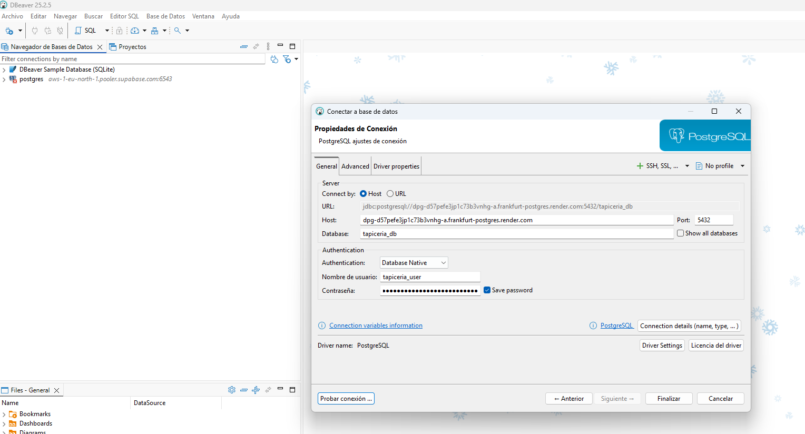

# 1️⃣ Estructura recomendada del proyecto
```
myproject/
│
├─ backend/             # Django
│  ├─ Dockerfile
│  ├─ requirements.txt
│  └─ myproject/
│      ├─ settings.py
│      └─ wsgi.py
│
├─ frontend/            # Vite + React
│  ├─ Dockerfile
│  └─ package.json
│
├─ docker-compose.yml   # Opcional para local
└─ README.md
```

# 2️⃣ Dockerizar Django (Backend)

Crea backend/Dockerfile:

```
# Usa imagen oficial de Python
FROM python:3.11-slim

# Variables de entorno
ENV PYTHONDONTWRITEBYTECODE 1
ENV PYTHONUNBUFFERED 1

WORKDIR /app

# Instala dependencias
COPY requirements.txt .
RUN pip install --upgrade pip && pip install -r requirements.txt

# Copia el proyecto
COPY . .

# Recoger archivos estáticos
RUN python manage.py collectstatic --noinput

# Expone el puerto que Render usará
EXPOSE 8000

# Comando por defecto para ejecutar Gunicorn
CMD ["gunicorn", "myproject.wsgi:application", "--bind", "0.0.0.0:8000"]
```

# 3️⃣ Dockerizar Vite (Frontend)

Crea frontend/Dockerfile:

```
# Usa Node.js para build
FROM node:20-alpine AS build

WORKDIR /app
COPY package*.json ./
RUN npm install
COPY . .
RUN npm run build

# Stage final: servidor ligero con Nginx
FROM nginx:stable-alpine

# Copiar build de Vite a carpeta de Nginx
COPY --from=build /app/dist /usr/share/nginx/html

# Exponer puerto estándar HTTP
EXPOSE 80

CMD ["nginx", "-g", "daemon off;"]
```


# Campos de creación en Render Postgres

1. Name

   - Es un nombre para identificar tu servicio en Render.

   - Ejemplo: myproject-db o tapiceria-db

2. Project

   - Si ya tienes un proyecto en Render, lo eliges aquí.

   - Si no, crea uno nuevo: TapiceriaRincon

3. Database

   -  Es el nombre de la base de datos que usarás en Django.

   - Ejemplo: myproject o tapiceria_db

4. User

   - Usuario que tendrá acceso a la base de datos.

   - Ejemplo: myuser o tapiceria_user

5. Region

   - Render tiene varias regiones de data center.

   - Para España, la más cercana es Frankfurt, Alemania (eu-central-1).

   - No hay un data center exactamente en Asturias/Avilés, así que lo más cercano es Alemania (EU).

6. Version

   - PostgreSQL version.

   - Elige la más reciente estable, por ejemplo 15 o 14

7. Datadog API key y Datadog region

   - Opcional si quieres monitorización.

   - Si no tienes Datadog, deja vacío. Render funciona sin esto.
  
## Ejemplo de configuracion final:
```
| Campo           | Valor ejemplo   |
| --------------- | --------------- |
| Name            | tapiceria-db    |
| Project         | TapiceriaRincon |
| Database        | tapiceria_db    |
| User            | tapiceria_user  |
| Region          | Frankfurt (EU)  |
| Version         | 15              |
| Datadog API Key | *vacío*         |
| Datadog Region  | *vacío*         |
```

- Debemos de configurar el .env
- Cambiar el settings.py para que pueda tomar la informacion
- Hacer la migracione - python manage.py migrate

## Despues de las migraciones podemos utilizar DBeaver 

La configuracion seria

